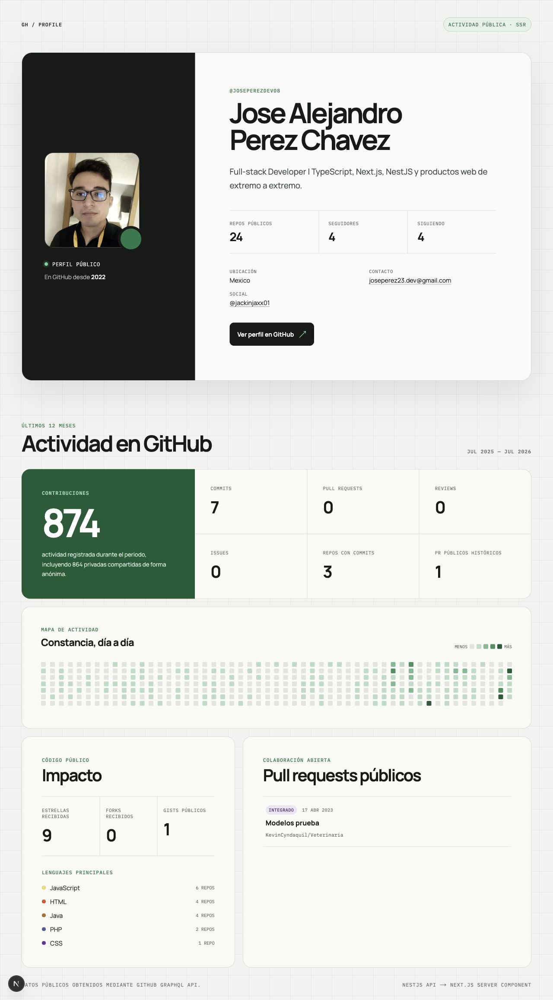
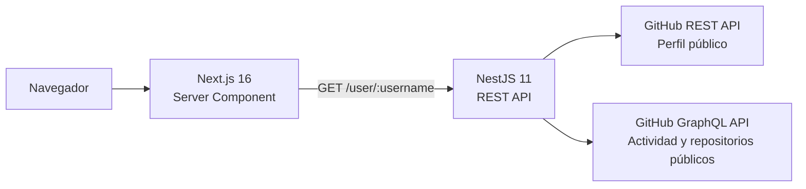

# GitHub Profile Showcase

[](https://github.com/joseperezdev08/github-profile-showcase/actions/workflows/ci.yml)
[](LICENSE)

Aplicación full-stack que presenta un perfil de GitHub y su actividad pública
reciente. Una API en **NestJS** consolida los datos oficiales de GitHub y una
interfaz **Next.js** los renderiza en el servidor con una experiencia pensada
para una revisión rápida por parte de reclutadores.



## Arquitectura



- **Next.js** realiza un único fetch desde un Server Component. El navegador
  recibe HTML renderizado y nunca consulta GitHub directamente.
- **NestJS** mantiene un controlador HTTP delgado, un servicio que valida y
  orquesta, un cliente dedicado a GitHub y un mapper puro para el contrato.
- **GitHub REST** proporciona los datos básicos del perfil. **GitHub GraphQL**
  aporta repositorios públicos, contribuciones y pull requests.
- Las respuestas externas se convierten a un contrato propio y estable en
  `camelCase`.

## Tecnologías

- Node.js 22, TypeScript 5.9 y pnpm con lockfiles y políticas de confianza.
- NestJS 11, ConfigModule y `fetch` nativo.
- Next.js 16, React 19, App Router y Server Components.
- Jest, Supertest, ESLint y Prettier.
- GitHub Actions para integración continua.

## Estructura

```text
.
├── apps/
│   ├── api/    # NestJS con package.json y pnpm-lock.yaml propios
│   └── web/    # Next.js con package.json y pnpm-lock.yaml propios
├── docs/       # Captura real de la aplicación
└── .github/    # Workflow de CI
```

Las aplicaciones comparten el repositorio, pero conservan instalaciones,
scripts y lockfiles independientes.

## API

### `GET /user/:username`

```bash
curl http://localhost:3001/user/joseperezdev08
```

Contrato de respuesta:

```ts
interface GitHubUserResponse {
  username: string;
  name: string | null;
  bio: string | null;
  avatarUrl: string;
  profileUrl: string;
  email: string | null;
  location: string | null;
  company: string | null;
  website: string | null;
  twitterUsername: string | null;
  publicRepositories: number;
  publicGists: number;
  followers: number;
  following: number;
  createdAt: string;
  updatedAt: string;
  repositoryMetrics: {
    starsReceived: number;
    forksReceived: number;
    topLanguages: Array<{
      name: string;
      color: string | null;
      repositoryCount: number;
    }>;
  };
  contributions: {
    from: string;
    to: string;
    total: number;
    restricted: number;
    commits: number;
    issues: number;
    pullRequests: number;
    reviews: number;
    repositoriesContributedTo: number;
    calendar: Array<{
      date: string;
      count: number;
      level: 0 | 1 | 2 | 3 | 4;
    }>;
  };
  publicPullRequests: {
    total: number;
    recent: Array<{
      title: string;
      url: string;
      repository: string;
      state: 'OPEN' | 'CLOSED' | 'MERGED';
      isDraft: boolean;
      createdAt: string;
      mergedAt: string | null;
    }>;
  };
}
```

Los campos opcionales conservan `null` cuando GitHub no los expone y el
frontend los omite de forma natural.

| Estado | Significado                                     |
| ------ | ----------------------------------------------- |
| `200`  | Perfil encontrado                               |
| `400`  | Username inválido                               |
| `404`  | Usuario inexistente                             |
| `429`  | Límite de peticiones de GitHub                  |
| `502`  | Error de red o respuesta inválida del proveedor |
| `503`  | Falta configurar el token requerido para GitHub |

## Privacidad

La aplicación trabaja exclusivamente con información pública:

- Los repositorios se consultan con `privacy: PUBLIC`.
- Los pull requests usan la búsqueda `is:pr author:<username> is:public`.
- Los cálculos de estrellas, forks y lenguajes descartan defensivamente
  cualquier nodo que no sea público.
- `restricted` es únicamente el conteo anónimo que GitHub devuelve cuando una
  persona decidió mostrar sus contribuciones privadas. No se exponen nombres,
  repositorios, títulos ni enlaces privados.
- No se muestran insignias o _Achievements_: GitHub no los ofrece mediante su
  API oficial y el proyecto no utiliza scraping.

## Ejecución local

### Requisitos

- Node.js `>= 22`
- pnpm disponible globalmente
- Un token de GitHub con acceso mínimo de lectura a información pública

### Instalación

```bash
pnpm --dir apps/api install
pnpm --dir apps/web install
cp apps/api/.env.example apps/api/.env
cp apps/web/.env.example apps/web/.env.local
```

Configura `GITHUB_TOKEN` en `apps/api/.env` y ejecuta cada aplicación en una
terminal independiente:

```bash
pnpm --dir apps/api dev
pnpm --dir apps/web dev
```

- Frontend: [http://localhost:3000](http://localhost:3000)
- Backend: [http://localhost:3001/user/joseperezdev08](http://localhost:3001/user/joseperezdev08)

### Variables de entorno

Backend (`apps/api/.env`):

| Variable       | Requerida | Descripción                                       |
| -------------- | --------- | ------------------------------------------------- |
| `GITHUB_TOKEN` | Sí        | Token para consumir GitHub GraphQL.               |
| `PORT`         | No        | Puerto de la API. Por defecto `3001`.             |
| `FRONTEND_URL` | No        | Orígenes permitidos por CORS, separados por coma. |

Frontend (`apps/web/.env.local`):

| Variable          | Requerida | Descripción                               |
| ----------------- | --------- | ----------------------------------------- |
| `API_URL`         | No        | URL interna de NestJS; por defecto local. |
| `GITHUB_USERNAME` | No        | Perfil mostrado; usa `joseperezdev08`.    |

Las variables del frontend son server-only; ninguna usa el prefijo
`NEXT_PUBLIC_`.

## Comandos

```bash
pnpm --dir apps/api dev       # Backend en desarrollo
pnpm --dir apps/api check     # Formato, lint, tipos, tests y build
pnpm --dir apps/web dev       # Frontend en desarrollo
pnpm --dir apps/web check     # Formato, lint, tipos y build
```

## Decisiones técnicas

### SSR sin una segunda petición

`app/page.tsx` es un Server Component y solicita
`API_URL/user/GITHUB_USERNAME` con `cache: "no-store"`. Cada visita obtiene
información reciente desde NestJS antes de producir el HTML, sin fetch desde el
navegador.

### REST y GraphQL con un solo endpoint propio

REST mantiene la lectura del perfil básico compatible con un token de mínimo
privilegio. GraphQL permite obtener el calendario, la actividad y los
repositorios públicos de manera estructurada. El frontend no necesita conocer
esa composición: consume un único contrato.

### Agregaciones correctas y acotadas

El backend pagina todos los repositorios públicos para calcular estrellas,
forks y los cinco lenguajes con presencia en más repositorios. La interfaz
muestra como máximo cinco pull requests recientes, pero conserva el total
histórico que informa GitHub.

### Arquitectura proporcional al reto

No hay persistencia ni reglas de dominio complejas. El controlador se limita al
transporte HTTP, el servicio representa el caso de uso, `GitHubClient` encapsula
la API externa y el mapper realiza transformaciones deterministas. Esta
separación permite probar cada motivo de cambio sin añadir DDD, repositorios o
capas ceremoniales.

## Pruebas

Las pruebas del backend se organizan por responsabilidad: cliente externo,
orquestación y mapper puro. Cubren transformación GraphQL, campos nulos,
calendario, niveles, paginación, agregación de estrellas, forks y lenguajes,
pull requests públicos, descarte de nodos privados, token ausente, validación
del username, usuario inexistente, rate limit, errores GraphQL, HTTP y de red.
También incluyen una prueba e2e del endpoint con el proveedor sustituido.

El frontend se valida con formato, lint, type-check y build de producción. La
integración local confirma que el perfil llega dentro del HTML SSR y que no
existe un fetch del perfil desde el navegador.

```bash
pnpm --dir apps/api check
pnpm --dir apps/web check
```

## Despliegue

El repositorio está preparado para desplegar frontend y backend por separado.
Esta etapa no incluye todavía URLs públicas de las aplicaciones.

## Licencia

[MIT](LICENSE) © 2026 Jose Alejandro Perez Chavez
