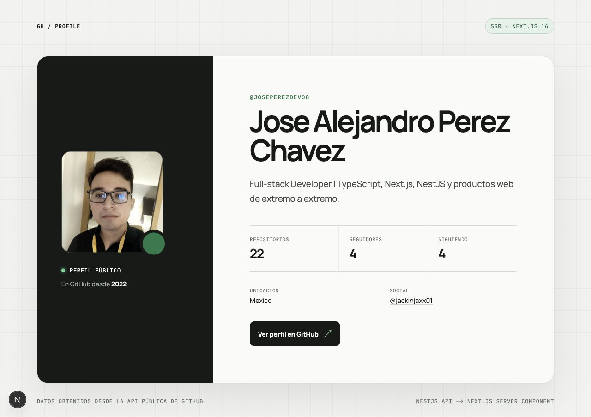
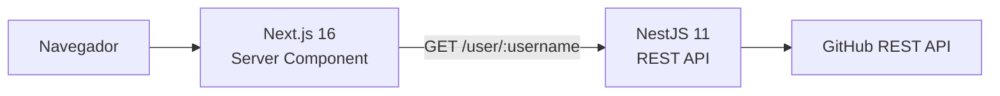

# GitHub Profile Showcase

[](https://github.com/joseperezdev08/github-profile-showcase/actions/workflows/ci.yml)
[](LICENSE)

Aplicación full-stack que consulta un perfil mediante una API en **NestJS** y lo
renderiza en el servidor con **Next.js**. El proyecto prioriza una solución
pequeña, legible y fácil de explicar, sin introducir infraestructura que el reto
no necesita.



## Arquitectura



- **Next.js** realiza la consulta desde un Server Component. El navegador recibe
  HTML ya renderizado y no repite la petición.
- **NestJS** separa el transporte HTTP de la integración con GitHub mediante un
  controlador y un servicio inyectable.
- **GitHubService** valida el username, aplica timeout, transforma el contrato
  externo y traduce errores del proveedor a estados HTTP claros.

## Tecnologías

- Node.js 22, TypeScript 5.9 y pnpm workspaces.
- NestJS 11 con ConfigModule y `fetch` nativo.
- Next.js 16, React 19 y App Router.
- Jest, Supertest, ESLint y Prettier.
- GitHub Actions para integración continua.

## Estructura

```text
.
├── apps/
│   ├── api/    # Endpoint NestJS
│   └── web/    # Interfaz Next.js con SSR
├── docs/       # Captura de la aplicación
└── .github/    # Workflow de CI
```

## API

### `GET /user/:username`

Ejemplo:

```bash
curl http://localhost:3001/user/joseperezdev08
```

Respuesta:

```json
{
  "username": "joseperezdev08",
  "name": "Jose Alejandro Perez Chavez",
  "bio": "Full-stack Developer | TypeScript, Next.js, NestJS y productos web de extremo a extremo.",
  "avatarUrl": "https://avatars.githubusercontent.com/...",
  "profileUrl": "https://github.com/joseperezdev08",
  "email": null,
  "location": "Mexico",
  "company": null,
  "website": null,
  "twitterUsername": "jackinjaxx01",
  "publicRepositories": 22,
  "followers": 4,
  "following": 4,
  "createdAt": "2022-01-02T17:20:26Z",
  "updatedAt": "2026-07-24T17:43:47Z"
}
```

Los campos opcionales conservan `null` cuando GitHub no los expone. El frontend
solo renderiza los valores disponibles.

| Estado | Significado                                 |
| ------ | ------------------------------------------- |
| `200`  | Perfil encontrado                           |
| `400`  | Username inválido                           |
| `404`  | Usuario inexistente                         |
| `429`  | Límite de peticiones de GitHub              |
| `502`  | Error de conexión o respuesta del proveedor |

## Ejecución local

### Requisitos

- Node.js `>= 22`
- Corepack habilitado

### Instalación

```bash
corepack enable
pnpm install
cp apps/api/.env.example apps/api/.env
cp apps/web/.env.example apps/web/.env.local
pnpm dev
```

Servicios disponibles:

- Frontend: [http://localhost:3000](http://localhost:3000)
- Backend: [http://localhost:3001/user/joseperezdev08](http://localhost:3001/user/joseperezdev08)

### Variables de entorno

Backend (`apps/api/.env`):

| Variable       | Requerida | Descripción                                       |
| -------------- | --------- | ------------------------------------------------- |
| `PORT`         | No        | Puerto de la API. Por defecto `3001`.             |
| `FRONTEND_URL` | No        | Orígenes permitidos por CORS, separados por coma. |
| `GITHUB_TOKEN` | No        | Aumenta el límite de peticiones de GitHub.        |

Frontend (`apps/web/.env.local`):

| Variable          | Requerida | Descripción                       |
| ----------------- | --------- | --------------------------------- |
| `API_URL`         | No        | URL interna de la API NestJS.     |
| `GITHUB_USERNAME` | No        | Usuario que se muestra al cargar. |

Las variables del frontend son server-only: no se exponen mediante el prefijo
`NEXT_PUBLIC_`.

## Comandos

```bash
pnpm dev          # Ejecuta API y frontend
pnpm lint         # Revisa ambos proyectos
pnpm typecheck    # Valida TypeScript
pnpm test         # Pruebas unitarias del backend
pnpm test:e2e     # Prueba HTTP del endpoint
pnpm build        # Compila ambas aplicaciones
pnpm check        # Ejecuta toda la verificación de CI
```

## Decisiones técnicas

### ¿Por qué SSR?

`app/page.tsx` es un Server Component y usa `cache: "no-store"`. Cada visita
obtiene información actualizada desde el endpoint NestJS antes de generar el
HTML. Esto evita estados de carga y una llamada adicional desde el navegador.

### ¿Por qué no hay más capas?

El dominio no contiene reglas de negocio complejas ni persistencia. Un
controlador delgado y un servicio de integración ofrecen separación de
responsabilidades, inyección de dependencias y pruebas aisladas sin convertir
el reto en una arquitectura ceremonial.

### ¿Cómo se manejan los fallos?

La API valida la entrada antes de llamar a GitHub, limita cada consulta a cinco
segundos y traduce los errores externos. Next.js incorpora `loading.tsx` y
`error.tsx` para cubrir espera y recuperación, mientras `next/image` y
`next/font` optimizan los recursos visuales.

## Pruebas

La suite cubre:

- Transformación de `snake_case` a `camelCase` y campos opcionales.
- Validación del username sin realizar peticiones innecesarias.
- Usuario inexistente, rate limit, error del proveedor y error de red.
- Endpoint HTTP con el servicio de GitHub sustituido mediante inyección.
- Lint, type-check, build y formato de ambas aplicaciones.

```bash
pnpm check
```

## Despliegue

El repositorio queda preparado para desplegar frontend y backend por separado.
Esta entrega no incluye todavía un despliegue público.

## Licencia

[MIT](LICENSE) © 2026 Jose Alejandro Perez Chavez
